# Clustering Methods

`Clustering` encompasses a wide range of techniques for identifying subgroups, or clusters, within a data set. 
The goal of clustering is to partition observations into distinct groups where the members of each group are highly similar to one another, yet significantly different from members of other groups. To achieve this, it’s essential to define what makes observations similar or different, which typically involves identifying patterns in an unlabeled data set, such as shape, size, color, or behavior. As an unsupervised learning method, clustering operates without predefined labels or guidance, analyzing the data independently.

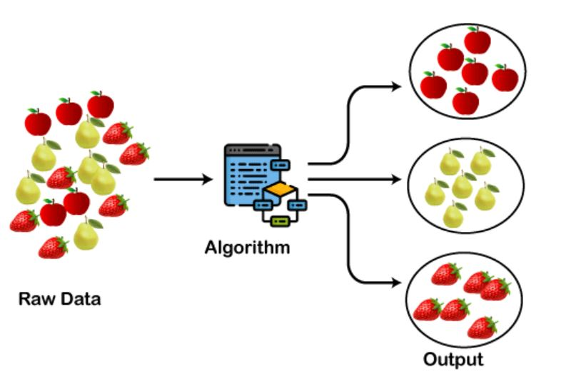 
[ref](https://www.javatpoint.com/clustering-in-machine-learning)

One practical application of clustering is in marketing, where we might analyze various metrics (e.g., median household income, occupation, proximity to urban areas) 
for a large population. The objective here is to perform market segmentation, grouping individuals into clusters that are more likely to respond 
to specific advertising strategies or purchase particular products. This segmentation process is effectively clustering the individuals in the data set.

Due to its widespread applicability, numerous clustering methods exist across different fields. Clustering methods are generally classified into 
Hard Clustering (where each data point belongs to only one group) and Soft Clustering (where data points can belong to multiple groups). 
However, several other approaches also exist. Key clustering methods in machine learning include:

1.	*Partitioning Clustering*: This method divides data into non-hierarchical groups, also known as centroid-based clustering. A common example is the `K-Means` algorithm, 
which partitions the data set into a predefined number of groups (k). 
Each cluster center is determined so that the distance between data points within a cluster is minimized compared to points in other clusters.

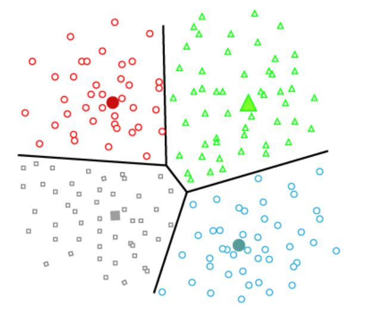 
[ref](https://www.javatpoint.com/clustering-in-machine-learning)

3.	*Density-Based Clustering*: This approach connects dense regions of data into clusters, forming arbitrarily shaped distributions as long as dense regions are connected. 
By identifying high-density clusters separated by sparser areas, these methods can struggle with varying densities and high-dimensional data. 
An example is the `DBSCAN` algorithm.

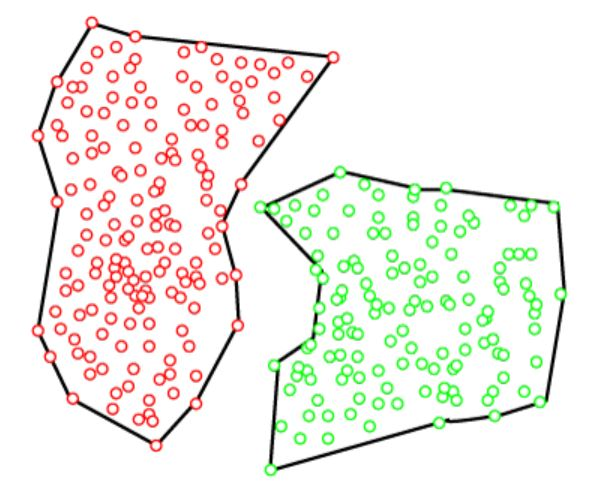 
[ref](https://www.javatpoint.com/clustering-in-machine-learning)

4.	*Distribution Model-Based Clustering*: This method clusters data based on the probability of belonging to a particular distribution, 
often assuming Gaussian distributions. A notable example is the Expectation-Maximization algorithm using `Gaussian Mixture Models` (GMM).

5.	*Hierarchical Clustering*: Unlike partitioning methods, `hierarchical clustering` does not require a predefined number of clusters. 
Instead, it creates a tree-like structure (dendrogram) that illustrates the hierarchy of clusters. Clusters can be formed at any 
level by cutting the dendrogram at the appropriate point. The Agglomerative Hierarchical algorithm is a typical example.

6.	*Fuzzy Clustering*: In this soft clustering method, data objects can belong to multiple clusters, with membership coefficients indicating the degree of belonging. 
The Fuzzy C-Means algorithm, also known as `Fuzzy K-Means`, is an example.
These diverse clustering techniques enable the analysis and segmentation of data sets in various ways, each with its unique strengths and applications.

### Hierarchical Clustering

Hierarchical clustering develops the hierarchy of clusters in the form of a tree. This tree-shaped structure is known as *dendrogram*. In fact, dendrogram is a tree diagram that is used to show the arrangement of clusters produced by hierarchical clustering. Instead of receiving a "smooth" output of clusters, hierarchical clustering gives us a tree of clusters. 

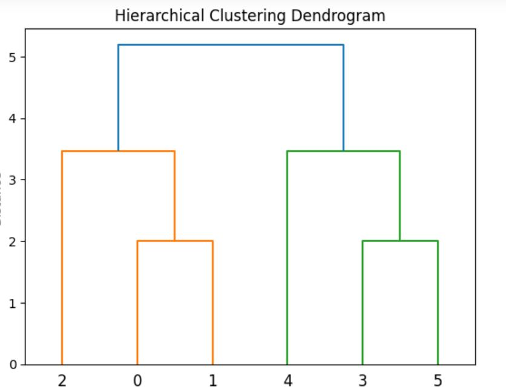 

When trying to learn a hierarchy from data, there are two approaches:

+ Agglomerative: It is a bottom-up approach in which the algorithm is performed by taking all data points as individual clusters and merging them until one cluster remains.

+ Divisive: This approach is the opposite of the agglomerative approach and is top-down. That is, it starts with all items in a cluster and recursively divides them into clusters until each item is in its own cluster.

#### How the Agglomerative Hierarchical clustering Work?

The hierarchical clustering dendrogram is constructed through a straightforward algorithm. First, we define a measure of dissimilarity between each pair of observations, often using Euclidean distance. The algorithm then proceeds iteratively:

Step 1: Initially, each of the n observations is treated as its own cluster.
 
Step 2: The two clusters that are most similar to each other are then merged, resulting in n-1 clusters.
 
Step 3: Step 2 is repeated, merging the two most similar clusters at each step, until all observations belong to a single cluster, completing the dendrogram.

#### Measure for the distance between two clusters

The key challenge is how to define the dissimilarity between two clusters, when one or both contain multiple observations. This is addressed by the concept of linkage, which specifies how to extend the pairwise dissimilarity measure to groups of observations. The four most common types of linkage are:

1. *Complete linkage*: The dissimilarity between two clusters is the maximum of all pairwise dissimilarities between observations in the two clusters.

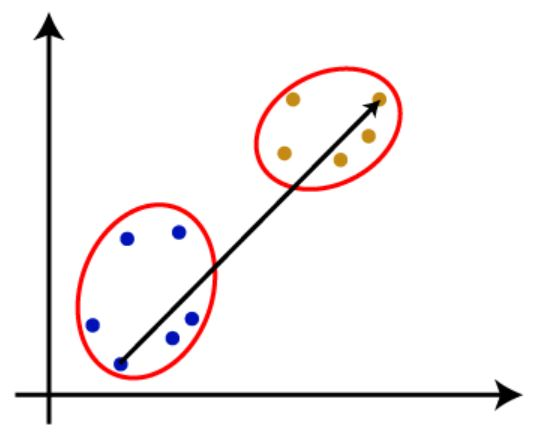 
   
2. *Single linkage*: The dissimilarity between two clusters is the minimum of all pairwise dissimilarities between observations in the two clusters. This can lead to elongated, "chaining" clusters.

 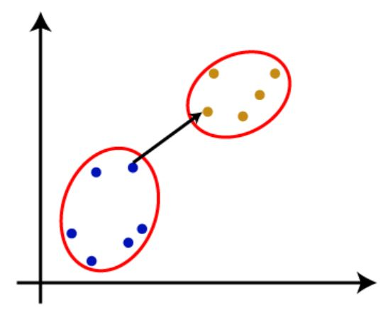 
 
3. *Average linkage*: The dissimilarity between two clusters is the average of all pairwise dissimilarities between observations in the two clusters.

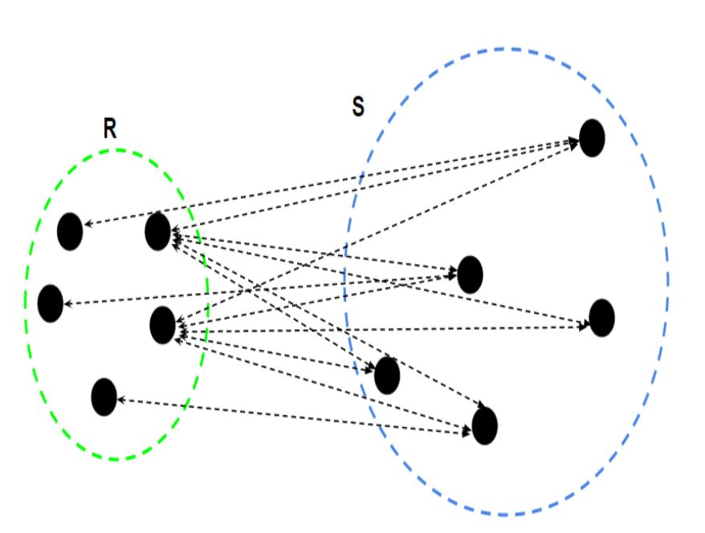 

4. *Centroid linkage*: The dissimilarity between two clusters is the dissimilarity between their centroids (the mean vectors of the observations in each cluster). This can sometimes result in undesirable inversions in the dendrogram.

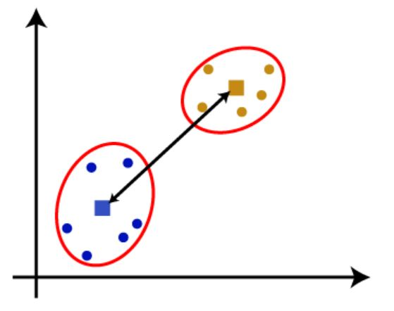 

### Woking of Dendrogram in Hierarchical clustering

Presented in the below figure, six observations $O_{0},…,O_{5}$ are clustered by using Single linkage and Euclidean distance. 

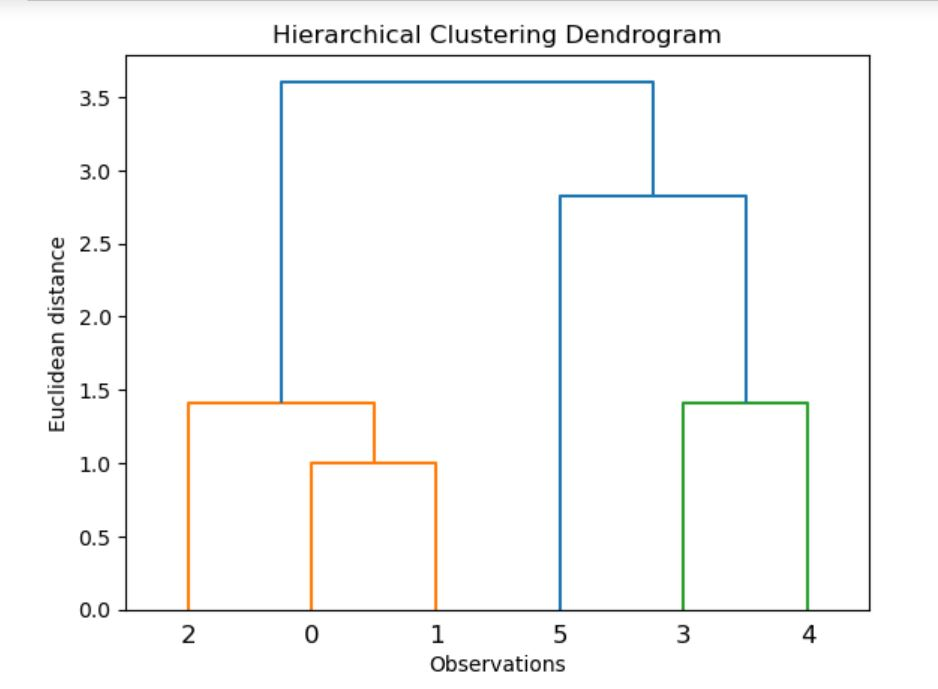 

Illustration of the steps of the agglomerative hierarchical clustering algorithm with Single linkage and Euclidean distance is shown as follows: 

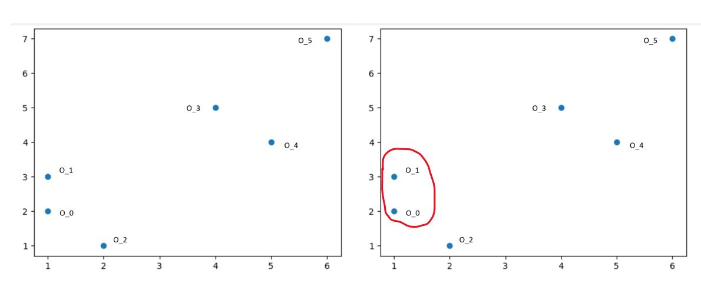 

Left: Each of the points $O_{0},…,O_{5}$ is considered as a separate cluster. Right: The datapoints $O_{0}$ and $O_{1}$ combine together and form a cluster, correspondingly a dendrogram is created, which connects $O_{0}$ and $O_{1}$ with a rectangular shape. The hight is decided according to the Euclidean distance between the data points.

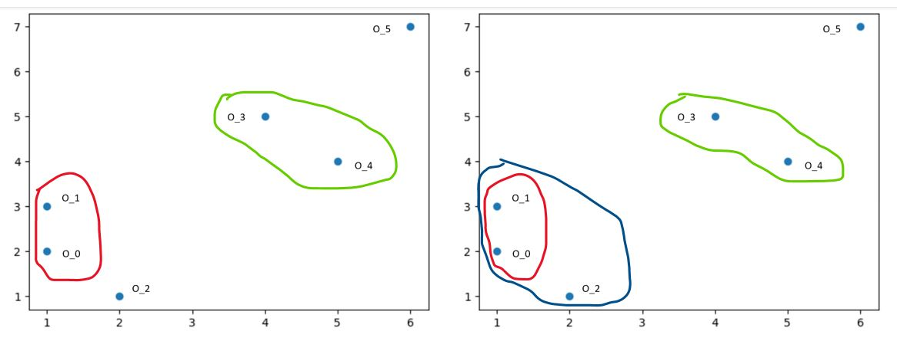 

Left: The two clusters  $O_{3}$ and $O_{4}$  form a cluster, and the corresponding dendrogram is created. It is higher than of previous, as the Euclidean distance between $O_{3}$ and $O_{4}$ is a little bit greater than the $O_{0}$ and $O_{1}$. Right: New dendrograms are created that combine $O_{0}$, $O_{1}$ and $O_{2}$ in one dendrogram. 

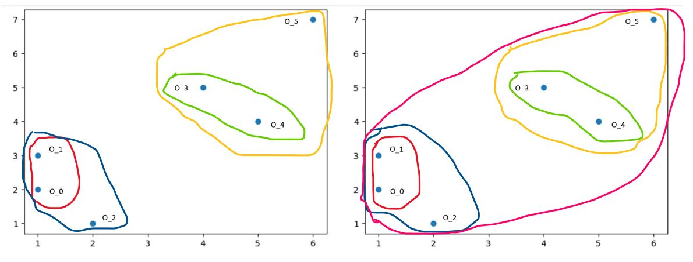 

Left: New dendrograms are created that combine $O_{3}$, $O_{4}$ and $O_{5}$  in one dendrogram. Right: At last, the final dendrogram is created that combines all the data points together.

## DBSCAN Clustering

We already have basic clustering algorithms, so why should you spend time and effort learning another one? Clustering is an unsupervised learning technique that groups data points based on specific characteristics. However, algorithms like K-Means and Hierarchical Clustering struggle with clusters of arbitrary shapes and varying densities. This is where DBSCAN (Density-Based Spatial Clustering of Applications with Noise) comes in.

##### Why DBSCAN?

DBSCAN excels at identifying clusters of various shapes and densities while effectively handling noise. Unlike K-Means, which assumes spherical clusters and is sensitive to outliers, DBSCAN groups data points based on density, making it more robust and versatile.

##### Example Scenario

Consider a dataset with points densely arranged in concentric circles. 

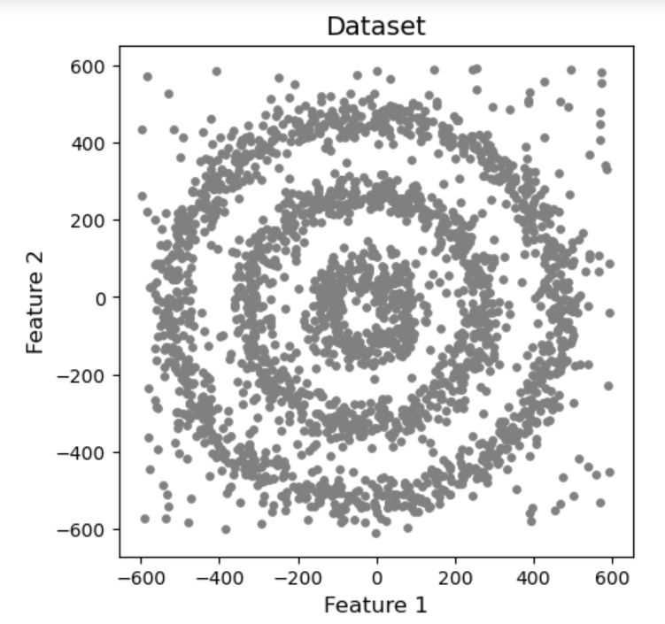 

When we apply K-Means and Hierarchical Clustering to this dataset, they fail to accurately cluster the points and properly detect the noise.

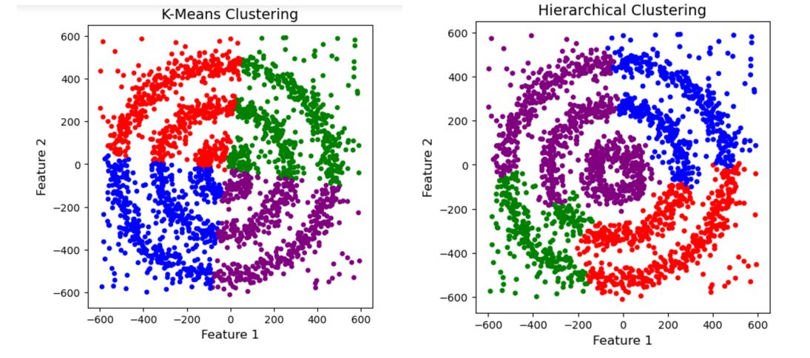 

In contrast, DBSCAN successfully identifies the three dense clusters and isolates the noise, demonstrating its superior capability in handling complex shapes and densities.

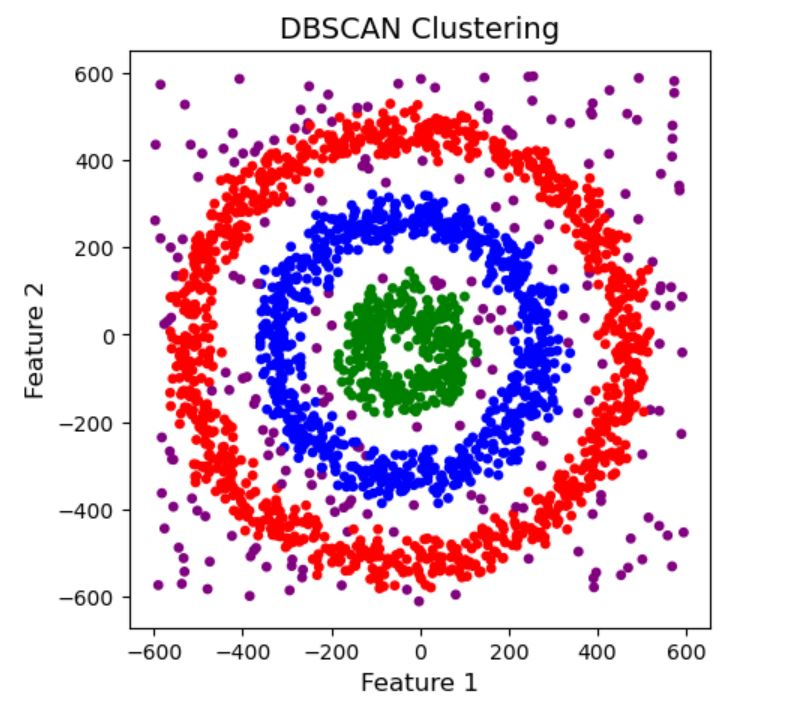

`DBSCAN` groups together data points that are close to each other based on density, rather than trying to create spherical clusters.
The key aspect of DBSCAN is that it can identify and exclude data points that are considered "noise" or outliers - those that do not belong to any dense cluster. This makes DBSCAN well-suited for tasks like outlier detection, as it can identify data points that lie outside the main groups or clusters.
In contrast, K-Means Clustering is very sensitive to outliers. Since it tries to create spherical clusters, the introduction of a single outlier can significantly impact the resulting clusters. DBSCAN, on the other hand, is more robust to outliers and can identify clusters of arbitrary shape, not just spherical ones.
Overall, DBSCAN is a powerful clustering algorithm that excels at handling noisy data and finding clusters of varying densities and shapes, making it a valuable tool in many data analysis and machine learning applications.

### How DBSCAN Works
DBSCAN requires two parameters:
1.	eps (ε): Defines the neighborhood radius around a data point. Points within this radius are considered neighbors. Choosing the right value is crucial; too small, and many points will be marked as noise; too large, and distinct clusters may merge. One way to find the eps value is based on the *k-distance graph*.
2.	MinPts: The minimum number of points required to form a dense region. This value should generally be at least the number of dimensions plus one. The larger the dataset, the larger value of MinPts must be chosen. The minimum value of MinPts must be chosen at least 3.

DBSCAN is highly sensitive to the choice of the epsilon (ε) and minPoints parameters. Selecting appropriate values for these hyperparameters is crucial, as small variations can significantly impact the clustering results produced by the DBSCAN algorithm. The value of epsilon (ε) can be determined using the k-distance graph. This graph plots the distance of each data point to its kth nearest neighbor. The "elbow" or point of maximum curvature in this graph typically indicates the appropriate value of epsilon to use. If the chosen epsilon value is too small, DBSCAN will identify a larger number of clusters, with more data points being classified as noise. Conversely, if epsilon is set too high, smaller clusters will merge into a single large cluster, resulting in a loss of detailed cluster structure.
   
### Key Concepts
DBSCAN classifies points into three categories:

•	Core points: Have at least MinPts neighbors within eps radius.

•	Border points: Have fewer neighbors than MinPts but are within eps of a core point.

•	Noise points: Neither core nor border points.

 
[ref](https://www.geeksforgeeks.org/dbscan-clustering-in-ml-density-based-clustering/)

##### Reachability and Connectivity

Reachability states if a data point can be accessed from another data point directly or indirectly, whereas connectivity states whether two data points belong to the same cluster or not. In terms of reachability and connectivity, two points in DBSCAN can be referred to as:

•	Directly Density-Reachable: Point X is directly density-reachable from point Y if X is within eps of Y and Y is a core point.

•	Density-Reachable: Point X is density-reachable from point Y if there is a chain of points connecting them, where each point in the chain is directly density-reachable from the previous one.

•	Density-Connected: Points X and Y are density-connected if they are both density-reachable from a common point O.

### Steps in DBSCAN Algorithm

1.	Choose eps and MinPts.
   
2.	For each point, calculate its distance to every other point.
   
3.	Identify all neighboring points within the eps radius.

4.	If the point has at least MinPts neighbors, mark it as a core point and create a new cluster if it isn't already part of one.
	
5.	If a point has fewer than MinPts neighbors but is near a core point, mark it as a border point.

6.	Include all density-connected points in the same cluster.
	
7.	Repeat for all unvisited points to identify all core, border, and noise points.

#### Advantages

•	Effectively finds clusters of arbitrary shapes and sizes.

•	No need to specify the number of clusters beforehand.

•	Identifies and handles noisy data.

##### Disadvantages

•	Struggles with clusters of varying densities.

•	Not suitable for high-dimensional datasets.

•	Can fail in datasets with narrow necks or bridge-like structures.

DBSCAN's ability to manage noise and identify clusters of varying shapes makes it an essential tool for complex data analysis. By understanding and utilizing DBSCAN, you can overcome the limitations of traditional clustering methods and unlock more sophisticated insights from your data.

### References

1. https://www.javatpoint.com/k-means-clustering-algorithm-in-machine-learning
2. https://www.geeksforgeeks.org/dbscan-clustering-in-ml-density-based-clustering/
3. https://www.analyticsvidhya.com/blog/2020/09/how-dbscan-clustering-works/
4. Gareth James, Daniela Witten, Trevor Hastie, Robert Tibshirani, (2013). 
An introduction to statistical learning : with applications in R. New York :Springer.

