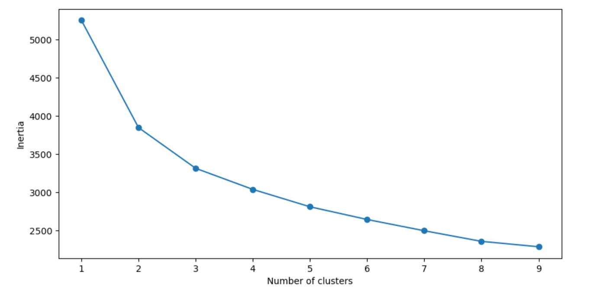
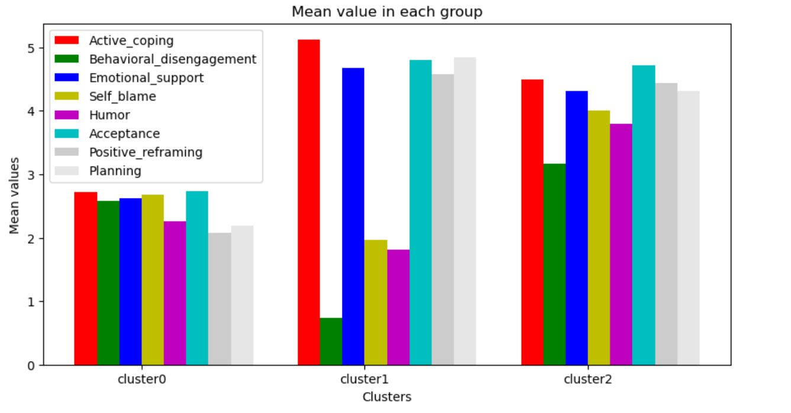
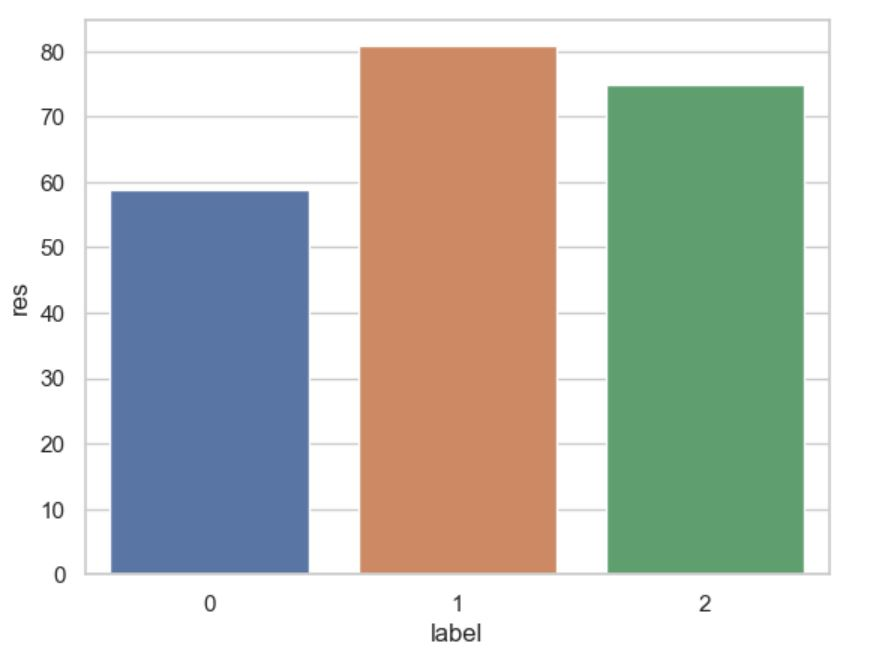

# K-Means Clustering for the coping strategies of Brief COPE Questionnaire
This repository contains the code and results of a `K-means clustering` implementation to extract different groups of `coping strategies` that influence `resilience`.  

# Note: This repository is being built and will be completed in the next one day
## Table of Contents
+ Introduction
+ Data
+ Methodology
+ Results

## Introduction

The [Brief COPE](https://github.com/AbbasPak/K-Means-Clustering-in-psychology-Case-study/blob/main/cope.rst) is a widely used self-report questionnaire that assesses coping strategies individuals use when faced with stress or challenging situations. The questionnaire consists of 28 items that measure 14 coping strategies *Self-distraction, Denial, Substance Use, Behavioural disengagement, Emotional Support, Venting, Humour, Acceptance, Self-Blame, Religion, Active Coping, Use of Instrumental Support, Positive Reframing*, and *Planning*.

Understanding coping strategies’ impact on psychological `well-being` is key to identifying strategies that may serve as resources for successful adaptation. Existing research has explored the relationship between coping styles and various mental health variables, such as resilience. `Resilience` might be seen as a personality trait—a positive, distinct feature of an individual that mitigates the negative effects of stress and minimizes episodes of depression. 

In this project, we apply the k-means clustering algorithm to cluster the coping strategies. The goal is to identify distinct groups of coping strategies that influence resilience. To do this, we first use different feature selection methods to extract important strategies that influence resilience. Then, we employ k-means clustering to cluster these coping strategies. Finally, by comparing the obtained clusters, strategies that can improve resilience are introduced.

## Data 
We utilized a preexisting dataset provided by Konaszewski et al. (Konaszewski K, Niesiobędzka M, Surzykiewicz J. Resilience and mental health among juveniles: role of strategies for coping with stress. Health Qual Life Outcomes. 2021 Feb 18;19(1):58) https://doi.org/10.3886/E120001V1. They investigate the direct and indirect role of resilience in shaping the mental health of juveniles. The dataset includes resilience and 14 coping strategies. 

## Methodology
### Feature Selection
Before applying k-means clustering, we employ various feature selection techniques to extract important coping strategies that significantly influence resilience. The selected coping strategies are then used as input for the clustering algorithm. [Notebook](https://github.com/AbbasPak/K-Means-Clustering-in-psychology-Case-study/blob/main/clustering%20coping.ipynb)
### Clustering 
Once the relevant coping strategies are identified, we utilize the [k-means clustering algorithm](https://github.com/AbbasPak/K-Means-Clustering-in-psychology-Case-study/blob/main/kmeans.rst) to group them into distinct clusters 
based on their similarities. [Notebook](https://github.com/AbbasPak/K-Means-Clustering-in-psychology-Case-study/blob/main/clustering%20coping.ipynb)

## Results

**Summary of feature selection**: The main features that were particularly important in influencing resilience are: *Active_coping, Planning , Emotional_support, Positive_reframing, Acceptance, Behavioral_disengagement, Humor* and *Self_blame*.

**K-means clustering**: Firstly, by using the Elbow method, three clusters were chosen. 

 

Then, k-means was conducted and the mean values of the selected coping strategies in each cluster were obtained as 

 

Further, the means of resilience in each cluster are obtained as 

 

Based on these results, the main attributes of each cluster are summarized as follows:

_Cluster 1_: This cluster includes juveniles with the most resilience. They had high average for Active_coping, Emotional_support, Acceptance, planning and Positive_reframing and low average in Behavioral_disengagement, Self_blame and Humor.

_Cluster 2_: juveniles with the moderate resilience. This group had moderate average in almost all features and high average for Active_coping and Acceptance.

_Cluster 0_: This group had the lowest value of resilience characteristic. Active_coping, Emotional_support, Acceptance, planning and Positive_reframing were minimum for these juveniles.

