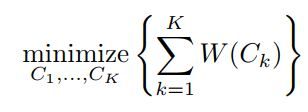
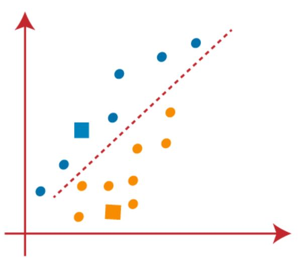

# K-means clustering algorithm

*K-means clustering* is a highly efficient and commonly used algorithm for partitioning data into clusters, providing a qualitative interpretation of the data by grouping similar conditions together. 

To perform k-means clustering, the first step is to determine the desired number of clusters, denoted as $k$. The k-means algorithm will then assign each observation to one of the $k$ clusters. The procedure is based on a straightforward and intuitive mathematical problem. Let's establish some notation: $C_{1}$, ... , $C_{k}$ represent sets containing the indices of observations in each cluster. If the $i$-th observation belongs to the $k$-th cluster, we say that $i ∈ C_{k}$.

The fundamental idea behind k-means clustering is to achieve a clustering arrangement in which the *within-cluster variation* is minimized. The within-cluster variation for a cluster $C_{k}$, denoted as $W(C_{k})$, quantifies the extent to which observations within the cluster differ from each other. Consequently, our goal is to solve the following problem:

	

In simple terms, this formula indicates that we aim to partition the observations into $K$ clusters such that the total within-cluster variation, summed over all $K$ clusters, is minimized.

While solving the above equation appears reasonable, it requires a definition of within-cluster variation to make it actionable. Various approaches exist for defining within-cluster variation, but the most widely adopted method involves *squared Euclidean distance*. Specifically, we define it as follows:

	

Here, $|C_{k}|$ denotes the number of observations in the $k$th cluster. In essence, the within-cluster variation for the $k$th cluster is computed as the sum of all pairwise squared Euclidean distances between observations within the cluster, divided by the total number of observations in that cluster. The objective of the K-means algorithm is to minimize the `within-cluster sum of squares (WCSS)`, also known as inertia or distortion. 

	

The algorithm achieves this by iteratively updating the centroids and reassigning data points to clusters. Here is the outline of the K-means algorithm:

1. Randomly assign a number from $1$ to $k$ to each observation, serving as initial cluster assignments.
2. Iterate until the cluster assignments no longer change:
   
   (a) For each of the $k$ clusters, compute the cluster centroid. The $k$th cluster centroid is determined by taking the vector of $p$ feature means for the observations in that cluster.
   
   (b) Assign each observation to the cluster whose centroid is closest, where "closest" is defined using Euclidean distance.

Let's understand the above steps by considering the visual plots:
The algorithm initially selects *k* data points randomly from the dataset as the initial centroids, which act as representatives of the clusters. 

For each data point, the algorithm calculates the distance between the point and each centroid. 

The data point is assigned to the cluster whose centroid is closest to it. 

After assigning all data points to clusters, new centroids are computed for each cluster by taking the mean of the data points assigned to that cluster. 

This step updates the positions of the centroids. These steps are repeated until convergence is achieved. Convergence occurs when the centroids' positions stabilize (i.e., no significant change occurs between iterations) or when a maximum number of iterations is reached. 

Upon convergence, the algorithm outputs the final centroids and the assignment of each data point to a cluster, representing the resulting clusters obtained from the K-means algorithm.

## Elbow method
An important aspect of k-means algorithm is the selection of the desired number of clusters, denoted as *k*. Several methods and heuristics exist to estimate the optimal number of clusters, such as the *elbow method* or *silhouette analysis*. The *elbow method* is a simple and intuitive technique that serves as a starting point for determining the optimal number of clusters in K-means clustering. This method relies on the observation that as the number of clusters increases, the WCSS typically decreases, as it measures the total distance between data points and their assigned cluster centroids. However, the decrease becomes less significant when the number of clusters becomes too large. To implement the elbow method, a range of values for *k* is chosen, starting with a small number and gradually increasing it. For each value of *k*, the K-means clustering algorithm is run, and the WCSS is calculated. A plot is then created with the number of clusters on the x-axis and the WCSS on the y-axis, often referred to as the elbow plot. The point on the plot where the WCSS starts to decrease at a slower rate is considered the elbow of the plot. The corresponding value of *k* at this point is considered the optimal number of clusters.

### References

1. https://www.javatpoint.com/k-means-clustering-algorithm-in-machine-learning
2. Gareth James, Daniela Witten, Trevor Hastie, Robert Tibshirani, (2013). An introduction to statistical learning : with applications in R. New York :Springer.
